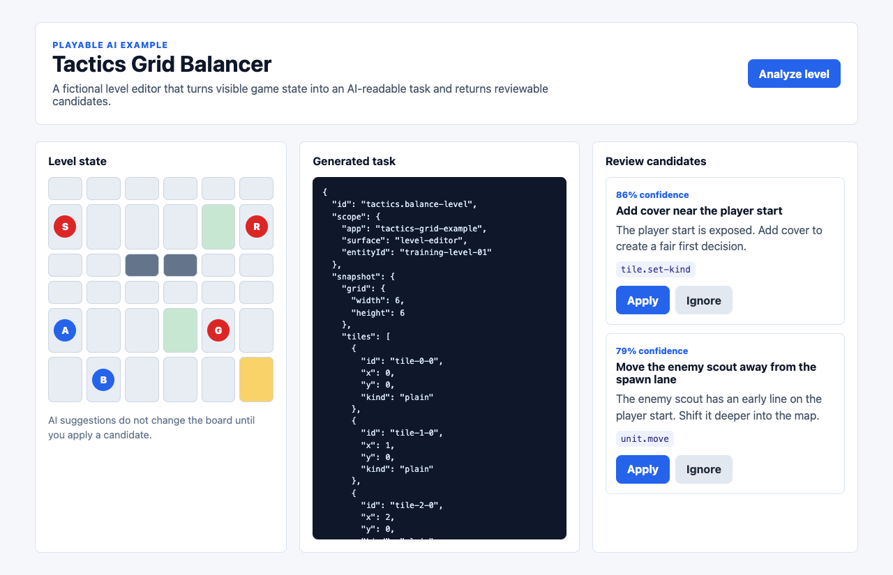
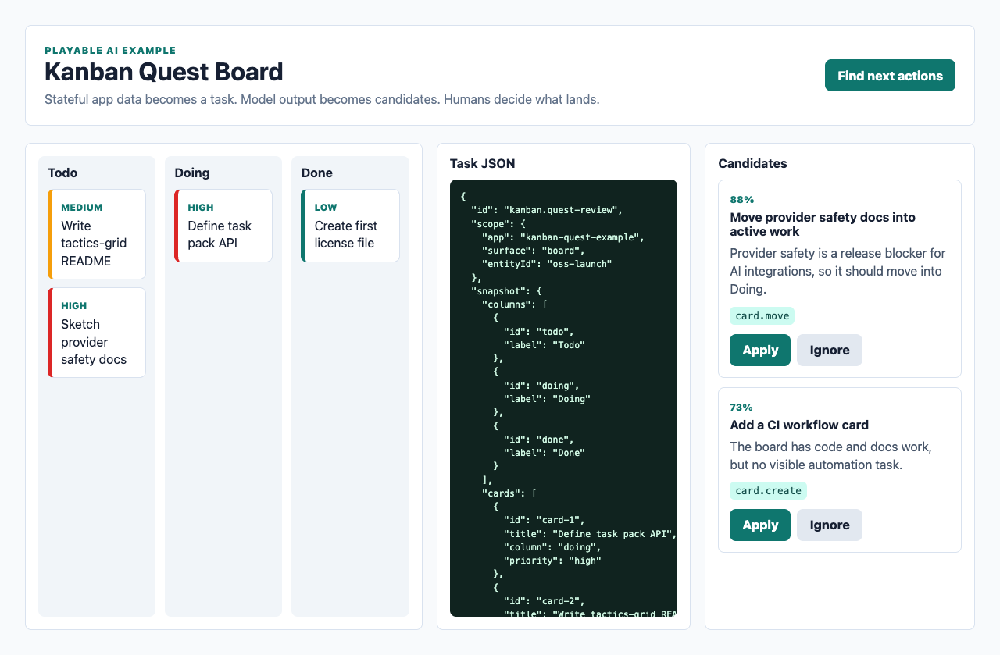
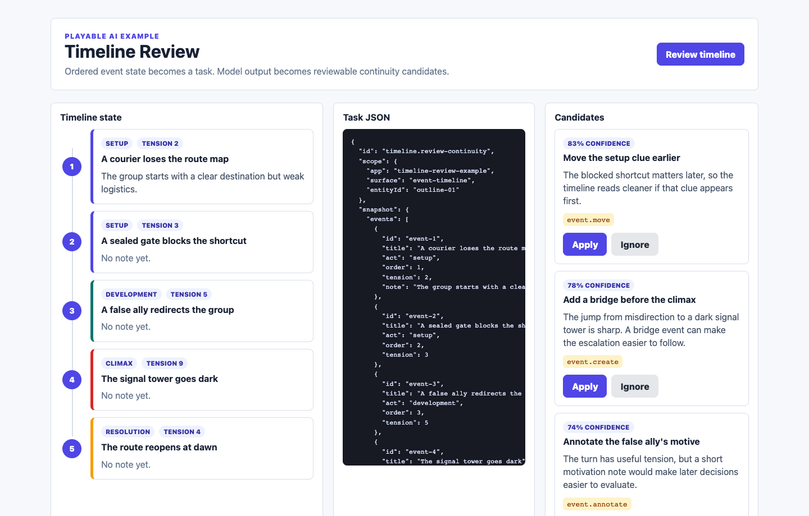

# Playable AI

[](https://github.com/dreamwars99/playable-ai/actions/workflows/check.yml)
[](https://github.com/dreamwars99/playable-ai/releases)
[](./LICENSE)

Turn interactive app state into structured AI tasks and human-reviewable candidates.

Playable AI is an open-source TypeScript toolkit for building applications where the user interacts with a product like a game, board, editor, map, canvas, or studio, while the AI layer works through explicit tasks, structured context, provider adapters, and reviewable results.

It aims to define a small open protocol between users, apps, and AI systems: apps expose scoped snapshots, AI returns structured candidates, and users stay in control of what gets applied.

## Quickstart

Run the repository locally:

```bash
git clone https://github.com/dreamwars99/playable-ai.git
cd playable-ai
corepack enable
pnpm install
pnpm check
```

Run an example app:

```bash
pnpm --filter @playable-ai/example-kanban-quest dev
```

Then open the local Vite URL, generate mock candidates, inspect the task JSON, and apply a validated candidate.

## Choose Your App Shape

Use the closest existing path, then adapt the task pack template to your app:

| If your app is... | Start with... |
| --- | --- |
| A board, kanban, or workflow tool | [`examples/kanban-quest`](./examples/kanban-quest) and [`docs/task-pack-template.md`](./docs/task-pack-template.md) |
| A grid, game editor, or simulation surface | [`examples/tactics-grid`](./examples/tactics-grid) and [`docs/integration-lifecycle.md`](./docs/integration-lifecycle.md) |
| A timeline, outline, or ordered review tool | [`examples/timeline-review`](./examples/timeline-review) and [`docs/task-pack-template.md`](./docs/task-pack-template.md) |
| A local-first app with a local runtime | [`docs/local-provider-guide.md`](./docs/local-provider-guide.md), [`docs/provider-safety.md`](./docs/provider-safety.md), and [`packages/server`](./packages/server) |
| A provider-backed app with a backend | [`docs/integration.md`](./docs/integration.md) and [`docs/provider-safety.md`](./docs/provider-safety.md) |

## At A Glance

- **Status:** early public SDK, source release `v0.2.0`
- **Core loop:** `snapshot -> task -> provider -> candidate -> validation -> review -> app-owned apply`
- **Packages:** framework-neutral core, optional React hooks, optional server/provider helpers
- **Examples:** tactics grid, kanban board, timeline review
- **Provider stance:** mock examples by default; remote provider secrets stay out of browser bundles
- **Local providers:** see [`docs/local-provider-guide.md`](./docs/local-provider-guide.md)
- **Template:** start with [`docs/task-pack-template.md`](./docs/task-pack-template.md)
- **Roadmap:** see [`docs/roadmap.md`](./docs/roadmap.md)

The core idea is simple:

```text
interactive state
-> scoped task
-> provider adapter
-> structured candidate
-> candidate validation
-> human review
-> apply / reject / edit / lock
```

It is not a prompt collection and it is not a chatbot wrapper. Playable AI is a small workflow layer for apps that need AI to understand product state without letting model output directly overwrite user-owned data.

## Why

Many AI apps start as a text box connected to a model. That works for quick generation, but it breaks down when an app has real state:

- cards on a board
- nodes in a graph
- timeline points
- manuscript sections
- map regions
- simulation entities
- design objects
- user-edited fields that must not be overwritten

Playable AI treats AI output as a candidate, not as a direct write. The user stays in control.

## What This Project Provides

The first public release includes a small set of reusable primitives:

- state snapshots
- task registry definitions
- provider adapter interfaces
- structured candidate envelopes
- evidence and provenance metadata
- apply policies
- review queues
- mock providers
- React hooks
- server-side provider helpers
- runnable React examples

## Example Use Cases

- a writing tool that turns a manuscript selection into review candidates
- a worldbuilding app that maps notes into structured entities
- a kanban board that asks AI to group or refine tasks
- a strategy game editor that asks AI to suggest balancing changes
- a diagram tool that asks AI to detect missing steps
- a local-first app that can use either a local sLLM endpoint or a remote provider

## Example Apps

Playable AI ships with small example apps that use the same core SDK contract.

| Example | What it proves | Run |
| --- | --- | --- |
| `examples/tactics-grid` | A fictional game/editor can turn a level map into reviewable balance candidates. | `pnpm --filter @playable-ai/example-tactics-grid dev` |
| `examples/kanban-quest` | A normal productivity board can use the same task/candidate flow. | `pnpm --filter @playable-ai/example-kanban-quest dev` |
| `examples/timeline-review` | An event timeline can turn continuity and pacing review into small human-approved candidates. | `pnpm --filter @playable-ai/example-timeline-review dev` |

All examples use mock providers. They do not call a remote model, do not need API keys, and do not mutate app state until the user applies a candidate.

### Tactics Grid



### Kanban Quest



### Timeline Review



## Open Source Impact

AI-assisted features are becoming a baseline expectation for many software products. Editors, games, dashboards, local-first tools, maps, notebooks, and simulations increasingly need AI workflows, but most apps still lack a safe, reusable way to connect model output to user-owned application state.

Playable AI is for maintainers who want more than a chat box. It gives open-source apps a shared user-app-AI protocol:

```text
snapshot -> task -> provider -> candidate -> validation -> human review -> app-owned apply
```

That pattern helps open-source projects:

- add AI workflows without exposing provider secrets in frontend code
- keep users in control of state changes
- support local models and OpenAI-compatible providers behind the same adapter shape
- make AI-generated changes reviewable, testable, and reversible
- let contributors add isolated examples without destabilizing the core SDK
- give AI coding agents clear instructions for extending a project safely

## Project Status

Playable AI is in early public development. The core SDK and three runnable examples exist today. Each example now demonstrates the full MVP loop: task creation, mock provider execution, candidate validation, human review, and host-owned apply.

Current focus:

1. harden the core task and candidate model
2. add integration guides and provider safety docs
3. grow React integration helpers
4. add more task packs and provider adapter examples
5. publish the first npm packages

## Repository Structure

Playable AI separates reusable SDK code from example apps:

```text
packages/core    framework-neutral SDK primitives
packages/react   optional React hooks for task and candidate workflows
packages/server  optional backend/provider helpers
examples/*       isolated demo apps
docs/*           public documentation
```

Example apps should stay inside `examples/<example-name>` so contributors can add demos without creating conflicts in the core SDK. See [`docs/repository-structure.md`](./docs/repository-structure.md) and [`CONTRIBUTING.md`](./CONTRIBUTING.md).

## Package Installation

The package is not published to npm yet. For now, use the repository directly through the quickstart above.

After the first npm release, the intended install path will be:

```bash
pnpm add playable-ai
```

or:

```bash
npm install playable-ai
```

## Intended API Shape

The core API is intentionally small:

```ts
import { createTask, createCandidate, validateCandidateForTask } from "playable-ai";

const task = createTask({
  id: "board.group-tasks",
  scope: {
    app: "demo-kanban",
    surface: "board",
    entityId: "sprint-42"
  },
  snapshot: {
    columns: ["Todo", "Doing", "Done"],
    cards: [
      { id: "card-1", title: "Write README", status: "Todo" },
      { id: "card-2", title: "Add adapter contract", status: "Doing" }
    ]
  }
});

const candidate = createCandidate({
  taskId: task.id,
  status: "suggested",
  confidence: 0.82,
  operations: [
    {
      type: "card.move",
      targetId: "card-1",
      payload: { status: "Doing" }
    }
  ],
  applyPolicy: "review_required"
});

const validation = validateCandidateForTask(task, candidate);

if (validation.valid) {
  // The host app can show the candidate for review or map it to app-owned commands.
}
```

See [`docs/task-pack-template.md`](./docs/task-pack-template.md), [`docs/concepts.md`](./docs/concepts.md), [`docs/api-reference.md`](./docs/api-reference.md), [`docs/integration.md`](./docs/integration.md), and [`docs/integration-lifecycle.md`](./docs/integration-lifecycle.md) for the integration model.

## React Hooks

React apps can use `@playable-ai/react` for a thin UI wiring layer:

```tsx
import { useCandidateQueue, usePlayableProviderRunner, usePlayableTaskPack } from "@playable-ai/react";

const task = usePlayableTaskPack(taskPack, appState, {
  app: "my-app",
  surface: "board",
  entityId: "sprint-42"
});

const queue = useCandidateQueue();
const runner = usePlayableProviderRunner(provider, {
  onCandidates: queue.enqueue
});
```

The React package does not own provider secrets or apply operations for you. Host apps still decide which candidates can be applied.

## Provider Model

Playable AI is provider-agnostic.

Adapters can target:

- OpenAI-compatible APIs
- local sLLM endpoints
- self-hosted model servers
- mocked or deterministic development providers

Provider output should be parsed into candidates and validated before the host app applies any operation.

Provider keys should stay outside browser bundles. Apps using Playable AI should route sensitive model calls through their own secure backend, local service, or explicitly user-controlled runtime.

See [`docs/provider-safety.md`](./docs/provider-safety.md).

Server-side apps can use `@playable-ai/server` to call OpenAI-compatible or local chat-completions-style endpoints:

```ts
import { createOpenAICompatibleProvider } from "@playable-ai/server";

const provider = createOpenAICompatibleProvider({
  id: "openai-compatible",
  endpoint: "https://api.openai.com/v1/chat/completions",
  apiKey: process.env.OPENAI_API_KEY,
  model: process.env.OPENAI_MODEL ?? "your-model"
});
```

The adapter expects JSON candidates and does not apply operations directly.

## React Apps

Playable AI is designed to work well in React apps, but the core package does not require React.

The current package split:

```text
packages/core      framework-neutral TypeScript primitives
packages/react     optional React hooks and helpers
packages/server    optional backend/provider helpers
examples/tactics-grid fictional game/editor demo
examples/kanban-quest productivity board demo
```

## Open-Core Friendly

This project is intentionally generic.

Commercial apps can keep their domain-specific prompts, private workflows, paid features, and production infrastructure closed while still using or contributing to the shared task/candidate workflow layer.

## Customize It With Your AI Agent

Playable AI is meant to be changed. Give this repository to your coding agent, ask it to read [`AGENTS.md`](./AGENTS.md), and have it create a task pack for your own app.

For example:

```text
Read README.md and AGENTS.md in this repository.
My app is a [game/editor/dashboard/board].
Design a Playable AI task pack that turns my app state into AI-readable tasks,
returns reviewable candidates, and never mutates my app state directly.
```

Your app keeps its own UI, backend, database, prompts, and business logic. Playable AI only provides the modifiable contract between app state, AI tasks, provider output, and human review.

## For AI Coding Agents

This repository includes an [`AGENTS.md`](./AGENTS.md) guide for Codex, OpenCode, Cline, Claude Code, and other AI coding agents. It explains the project boundaries, moddability contract, provider safety rules, and how to add task packs or examples without turning Playable AI into a closed prompt wrapper.

## Maintainer Notes

- [`CHANGELOG.md`](./CHANGELOG.md) tracks release changes.
- [`docs/maintenance.md`](./docs/maintenance.md) explains the maintainer workflow.
- [`docs/release.md`](./docs/release.md) explains the release workflow.
- [`docs/roadmap.md`](./docs/roadmap.md) explains the public roadmap.
- [`SECURITY.md`](./SECURITY.md) explains security boundaries and vulnerability reporting.
- [`CODE_OF_CONDUCT.md`](./CODE_OF_CONDUCT.md) sets contribution expectations.
- [`docs/codex-for-oss-application-notes.md`](./docs/codex-for-oss-application-notes.md) summarizes the project for open-source support applications.

## License

MIT
